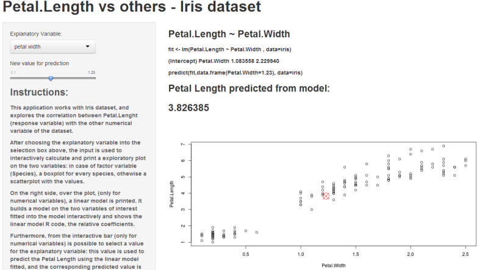

### Application to show the correlation between Petal.Length and other explanatory varibles.

First, Iris dataset is loaded: 

```r
data(iris)
str(iris)
```

```
## 'data.frame':	150 obs. of  5 variables:
##  $ Sepal.Length: num  5.1 4.9 4.7 4.6 5 5.4 4.6 5 4.4 4.9 ...
##  $ Sepal.Width : num  3.5 3 3.2 3.1 3.6 3.9 3.4 3.4 2.9 3.1 ...
##  $ Petal.Length: num  1.4 1.4 1.3 1.5 1.4 1.7 1.4 1.5 1.4 1.5 ...
##  $ Petal.Width : num  0.2 0.2 0.2 0.2 0.2 0.4 0.3 0.2 0.2 0.1 ...
##  $ Species     : Factor w/ 3 levels "setosa","versicolor",..: 1 1 1 1 1 1 1 1 1 1 ...
```
As you can see Species variable is factor, while the others are numeric... 

--- .class #id 


### Input parameter

Next, in the Ui.R file, we set the parameters accepted as input, in form of a list: 


```r
names(list("species" = "Species", "petal with" = "Petal.Width", "sepal length" = "Sepal.Length", 
           "sepal with" = "Sepal.Width"))
```

```
## [1] "species"      "petal with"   "sepal length" "sepal with"
```
and a variable named speciesplot needed to handle the plotting by the "server" side. The corresponding html tag is generated:

```r
library(shiny); p <- plotOutput("speciesplot"); print(p)
```

```
## <div id="speciesplot" class="shiny-plot-output" style="width: 100% ; height: 400px"></div>
```

--- .class #id 

### Server side :

Into the server file, we define a reactive function to read the input variable and build the string used for plotting. 

```r
shinyServer(function(input, output) { formulaText <- reactive({
    paste("Petal.Length ~ ", input$explanatoryvariable) })})
```
A linear model is printed. It is builded interactively on the two variables of interest. The App show the linear model R code, and the relative coefficients. Furthermore, from the interactive bar (only for numerical variables) is possible to select a value for the explanatory variable: this value is used to predict the Petal Length using the linear model fitted, and the corresponding prediction is plotted over the same plot.

```{, eval = F}
formulaText1 <- reactive({
    paste("lm(Petal.Length ~ ", input$explanatoryvariable, ", data=iris)")
  })
  output$lm <- ({  renderText(formulaText1() )})  

  formulaText2 <- reactive({
    eval(parse(text=paste("lm(Petal.Length ~ ", input$explanatoryvariable, ", data=iris)")))$coef
  })
```


--- .class #id 

### Result :
The plot command is called using the string containing the response variable and the explanatory variable and value already selected: the prediction from the linear model fitted is plotted over the data plot:

```r
plot(as.formula(formulaText()),  data = iris)
```

<div></div>

